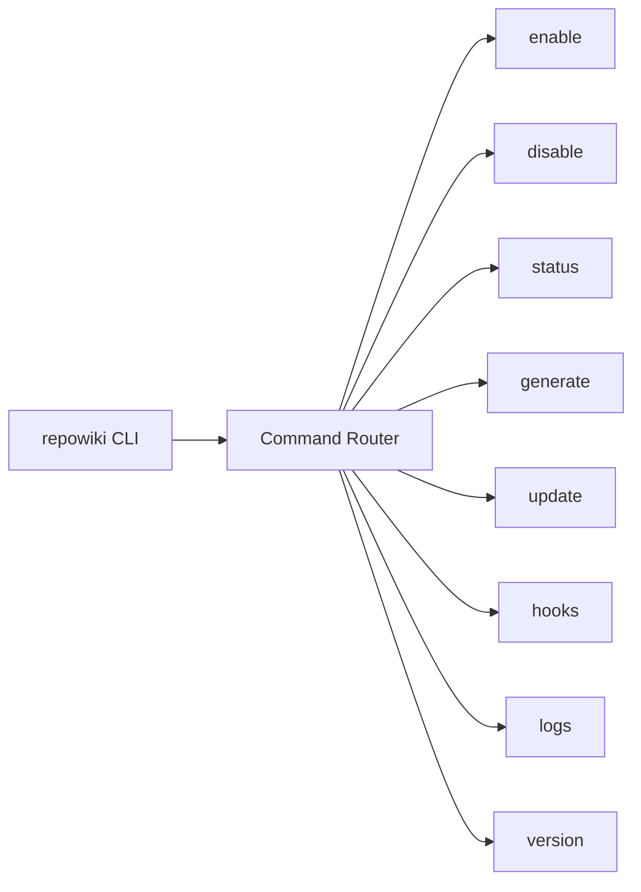
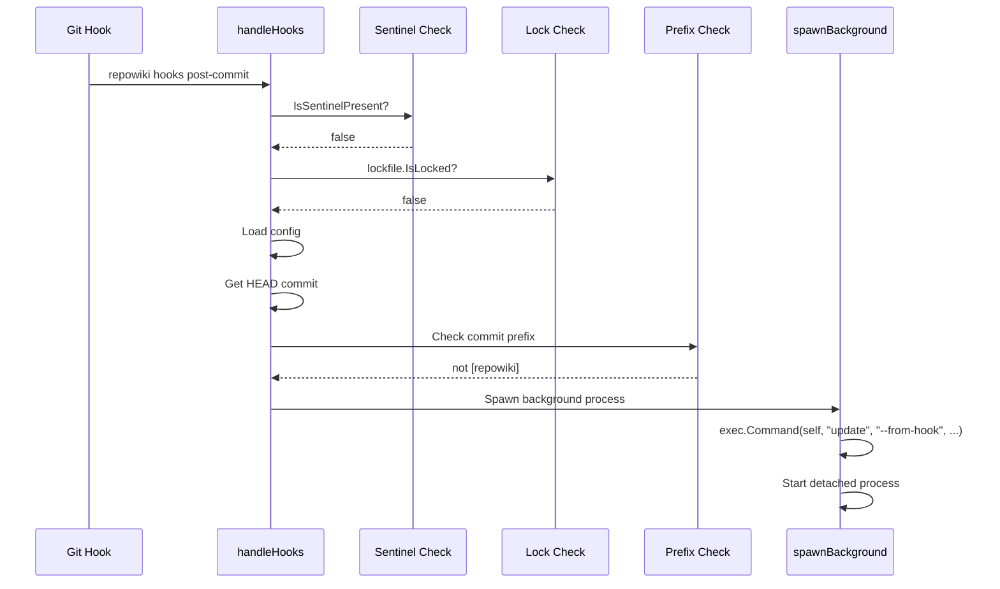

# CLI Commands

<cite>
Source files referenced:
- [cmd/repowiki/main.go](file://cmd/repowiki/main.go)
- [cmd/repowiki/enable.go](file://cmd/repowiki/enable.go)
- [cmd/repowiki/disable.go](file://cmd/repowiki/disable.go)
- [cmd/repowiki/status.go](file://cmd/repowiki/status.go)
- [cmd/repowiki/generate.go](file://cmd/repowiki/generate.go)
- [cmd/repowiki/update.go](file://cmd/repowiki/update.go)
- [cmd/repowiki/hooks.go](file://cmd/repowiki/hooks.go)
- [cmd/repowiki/logs.go](file://cmd/repowiki/logs.go)
</cite>

## Table of Contents

- [Command Overview](#command-overview)
- [Command Router](#command-router)
- [Enable Command](#enable-command)
- [Disable Command](#disable-command)
- [Status Command](#status-command)
- [Generate Command](#generate-command)
- [Update Command](#update-command)
- [Hooks Command](#hooks-command)
- [Logs Command](#logs-command)

## Command Overview

The repowiki CLI follows a standard command-based architecture with a central router dispatching to specific handlers.



## Command Router

The main entry point in `cmd/repowiki/main.go` handles command routing:

```go
const Version = "0.1.0"

func main() {
    if len(os.Args) < 2 {
        printUsage()
        os.Exit(0)
    }

    switch os.Args[1] {
    case "enable":
        handleEnable(os.Args[2:])
    case "disable":
        handleDisable(os.Args[2:])
    case "status":
        handleStatus(os.Args[2:])
    case "generate":
        handleGenerate(os.Args[2:])
    case "update":
        handleUpdate(os.Args[2:])
    case "hooks":
        handleHooks(os.Args[2:])
    case "logs":
        handleLogs(os.Args[2:])
    case "version", "--version", "-v":
        fmt.Printf("repowiki v%s\n", Version)
    case "help", "--help", "-h":
        printUsage()
    default:
        fmt.Fprintf(os.Stderr, "Unknown command: %s\n", os.Args[1])
        os.Exit(1)
    }
}
```

## Enable Command

**File**: `cmd/repowiki/enable.go`

Installs repowiki into the current git repository.

### Flags

| Flag | Type | Description |
|------|------|-------------|
| `--engine` | string | AI engine: `qoder`, `claude-code`, `codex` (default: `qoder`) |
| `--engine-path` | string | Path to engine CLI binary |
| `--model` | string | Engine-specific model level |
| `--force` | bool | Reinstall hook even if already present |
| `--no-auto-commit` | bool | Don't auto-commit wiki changes |

### Implementation

```go
func handleEnable(args []string) {
    fs := flag.NewFlagSet("enable", flag.ExitOnError)
    force := fs.Bool("force", false, "reinstall hook even if present")
    engine := fs.String("engine", "", "AI engine: qoder, claude-code, codex")
    enginePath := fs.String("engine-path", "", "path to engine CLI binary")
    model := fs.String("model", "", "model level (engine-specific)")
    noAutoCommit := fs.Bool("no-auto-commit", false, "don't auto-commit wiki changes")
    fs.Parse(args)

    // 1. Validate git repository
    gitRoot, err := git.FindRoot()
    if err != nil {
        fmt.Fprintf(os.Stderr, "Error: not a git repository\n")
        os.Exit(1)
    }

    // 2. Load or create config
    cfg, err := config.Load(gitRoot)
    if err != nil {
        cfg = config.Default()
    }

    // 3. Apply flag overrides
    if *engine != "" {
        if !config.IsValidEngine(*engine) {
            fmt.Fprintf(os.Stderr, "Error: unknown engine %q\n", *engine)
            os.Exit(1)
        }
        cfg.Engine = *engine
    }
    if *enginePath != "" {
        cfg.EnginePath = *enginePath
    }
    if *model != "" {
        cfg.Model = *model
    }
    if *noAutoCommit {
        cfg.AutoCommit = false
    }
    cfg.Enabled = true

    // 4. Validate engine binary is reachable
    binPath, findErr := wiki.FindEngineBinary(cfg)
    if findErr != nil {
        fmt.Fprintf(os.Stderr, "Warning: %v\n", findErr)
    }

    // 5. Save config
    config.Save(gitRoot, cfg)
    
    // 6. Determine absolute path to this binary for the hook
    selfPath, _ := os.Executable()
    
    // 7. Install git hook
    hook.Install(gitRoot, *force, selfPath)
    
    // 8. Create Qoder command
    createQoderCommand(gitRoot)
}
```

### Qoder Command Creation

The enable command also creates a custom Qoder command at `.qoder/commands/update-wiki.md`:

```go
func createQoderCommand(gitRoot string) {
    cmdDir := filepath.Join(gitRoot, ".qoder", "commands")
    os.MkdirAll(cmdDir, 0755)

    cmdPath := filepath.Join(cmdDir, "update-wiki.md")
    if _, err := os.Stat(cmdPath); err == nil {
        return // Already exists
    }

    content := `---
description: Update the repository wiki documentation based on recent code changes
---

You are a technical documentation specialist. Update the repository wiki in ` + "`" + `.qoder/repowiki/` + "`" + ` to reflect the current state of the codebase.

## Instructions

1. Run ` + "`" + `git diff --name-only HEAD~5 HEAD` + "`" + ` to see recently changed files
2. Read the changed source files to understand what was modified
3. Read the existing wiki pages in ` + "`" + `.qoder/repowiki/en/content/` + "`" + `
4. Update any wiki pages that reference or document the changed code
5. If new modules/features were added without wiki coverage, create new pages
6. Update ` + "`" + `.qoder/repowiki/en/meta/repowiki-metadata.json` + "`" + ` with new code snippet references

## Formatting Rules

- Each wiki page starts with an H1 title
- Include a ` + "`" + `<cite>` + "`" + ` block listing all source files referenced
- Include a Table of Contents after the cite block
- Use mermaid diagrams for architecture documentation
- Reference code with ` + "`" + `file://path/to/file` + "`" + ` format in cite blocks

## Constraints

- Do NOT modify any source code files
- Only create/modify files within ` + "`" + `.qoder/repowiki/` + "`" + `
`
    os.WriteFile(cmdPath, []byte(content), 0644)
}
```

## Disable Command

**File**: `cmd/repowiki/disable.go`

Removes repowiki from the current project.

```go
func handleDisable(args []string) {
    gitRoot, err := git.FindRoot()
    if err != nil {
        fmt.Fprintf(os.Stderr, "Error: not a git repository\n")
        os.Exit(1)
    }

    // 1. Remove hook
    if err := hook.Uninstall(gitRoot); err != nil {
        fmt.Fprintf(os.Stderr, "Error removing hook: %v\n", err)
        os.Exit(1)
    }

    // 2. Update config
    cfg, err := config.Load(gitRoot)
    if err == nil {
        cfg.Enabled = false
        config.Save(gitRoot, cfg)
    }

    fmt.Printf("repowiki disabled in %s\n", gitRoot)
    fmt.Printf("Wiki files in .qoder/repowiki/ are preserved.\n")
}
```

## Status Command

**File**: `cmd/repowiki/status.go`

Displays current configuration and status.

```go
func handleStatus(args []string) {
    gitRoot, err := git.FindRoot()
    if err != nil {
        fmt.Fprintf(os.Stderr, "Error: not a git repository\n")
        os.Exit(1)
    }

    fmt.Printf("repowiki v%s\n\n", Version)

    // Config
    cfg, cfgErr := config.Load(gitRoot)
    if cfgErr != nil {
        fmt.Printf("  Status:       not configured\n")
        fmt.Printf("  Run 'repowiki enable' to get started.\n")
        return
    }

    if cfg.Enabled {
        fmt.Printf("  Status:       enabled\n")
    } else {
        fmt.Printf("  Status:       disabled\n")
    }

    // Engine
    fmt.Printf("  Engine:       %s\n", cfg.Engine)

    // Hook
    if hook.IsInstalled(gitRoot) {
        fmt.Printf("  Hook:         installed (.git/hooks/post-commit)\n")
    } else {
        fmt.Printf("  Hook:         not installed\n")
    }

    // Engine binary
    binPath, engineErr := wiki.FindEngineBinary(cfg)
    if engineErr == nil {
        fmt.Printf("  Binary:       %s\n", binPath)
    } else {
        fmt.Printf("  Binary:       not found (%s)\n", cfg.Engine)
    }

    // Wiki
    contentDir := filepath.Join(gitRoot, cfg.WikiPath, cfg.Language, "content")
    if entries, err := os.ReadDir(contentDir); err == nil {
        count := countMdFiles(contentDir)
        fmt.Printf("  Wiki path:    %s/%s/content/ (%d pages)\n", cfg.WikiPath, cfg.Language, count)
    } else {
        fmt.Printf("  Wiki path:    %s (not generated yet)\n", cfg.WikiPath)
    }

    // Config details
    if cfg.Model != "" {
        fmt.Printf("  Model:        %s\n", cfg.Model)
    }
    fmt.Printf("  Auto-commit:  %v\n", cfg.AutoCommit)
    fmt.Printf("  Max turns:    %d\n", cfg.MaxTurns)

    if cfg.LastRun != "" {
        fmt.Printf("  Last run:     %s\n", cfg.LastRun)
    }
    if cfg.LastCommitHash != "" {
        fmt.Printf("  Last commit:  %s\n", cfg.LastCommitHash)
    }
}
```

## Generate Command

**File**: `cmd/repowiki/generate.go`

Performs full wiki generation from scratch.

```go
func handleGenerate(args []string) {
    gitRoot, err := git.FindRoot()
    if err != nil {
        fmt.Fprintf(os.Stderr, "Error: not a git repository\n")
        os.Exit(1)
    }

    cfg, err := config.Load(gitRoot)
    if err != nil {
        fmt.Fprintf(os.Stderr, "Error: repowiki not configured. Run 'repowiki enable' first.\n")
        os.Exit(1)
    }

    head, _ := git.HeadCommit(gitRoot)

    fmt.Println("Starting full wiki generation... (this may take several minutes)")

    if err := wiki.FullGenerate(gitRoot, cfg, head); err != nil {
        fmt.Fprintf(os.Stderr, "Error: %v\n", err)
        os.Exit(1)
    }

    fmt.Println("Wiki generation complete.")
}
```

## Update Command

**File**: `cmd/repowiki/update.go`

Performs incremental or full update based on changed files.

### Flags

| Flag | Type | Description |
|------|------|-------------|
| `--commit` | string | Specific commit hash to process |
| `--from-hook` | bool | Internal: indicates hook-triggered run |

### Implementation

```go
func handleUpdate(args []string) {
    fs := flag.NewFlagSet("update", flag.ExitOnError)
    commitHash := fs.String("commit", "", "specific commit hash")
    fromHook := fs.Bool("from-hook", false, "internal: hook-triggered")
    fs.Parse(args)

    // 1. Get git root and config
    gitRoot, err := git.FindRoot()
    cfg, err := config.Load(gitRoot)

    // 2. Determine commit to process
    hash := *commitHash
    if hash == "" {
        hash, err = git.HeadCommit(gitRoot)
    }

    // 3. Get changed files
    var changedFiles []string
    if cfg.LastCommitHash != "" && cfg.LastCommitHash != hash {
        changedFiles, err = git.ChangedFilesSince(gitRoot, cfg.LastCommitHash)
    } else {
        changedFiles, err = git.ChangedFilesInCommit(gitRoot, hash)
    }

    // 4. Filter excluded paths
    changedFiles = filterExcluded(changedFiles, cfg.ExcludedPaths)

    if len(changedFiles) == 0 {
        if !*fromHook {
            fmt.Println("No relevant file changes detected.")
        }
        return
    }

    // 5. Decide: full generate or incremental
    if !wiki.Exists(gitRoot, cfg) || len(changedFiles) > cfg.FullGenerateThreshold {
        if !*fromHook {
            fmt.Printf("Running full wiki generation (%d files changed)...\n", len(changedFiles))
        }
        if err := wiki.FullGenerate(gitRoot, cfg, hash); err != nil {
            fmt.Fprintf(os.Stderr, "Error: %v\n", err)
            os.Exit(1)
        }
    } else {
        if !*fromHook {
            fmt.Printf("Updating wiki for %d changed files...\n", len(changedFiles))
        }
        if err := wiki.IncrementalUpdate(gitRoot, cfg, changedFiles, hash); err != nil {
            fmt.Fprintf(os.Stderr, "Error: %v\n", err)
            os.Exit(1)
        }
    }

    if !*fromHook {
        fmt.Println("Wiki update complete.")
    }
}
```

### File Filtering

```go
func filterExcluded(files []string, excluded []string) []string {
    var result []string
    for _, f := range files {
        skip := false
        for _, ex := range excluded {
            if len(f) >= len(ex) && f[:len(ex)] == ex {
                skip = true
                break
            }
        }
        if !skip {
            result = append(result, f)
        }
    }
    return result
}
```

## Hooks Command

**File**: `cmd/repowiki/hooks.go`

Internal entry point called by the git post-commit hook.



### Implementation

```go
func handleHooks(args []string) {
    if len(args) == 0 || args[0] != "post-commit" {
        return
    }

    gitRoot, err := git.FindRoot()
    if err != nil {
        return
    }

    // Loop prevention layer 1: sentinel file
    if wiki.IsSentinelPresent(gitRoot) {
        return
    }

    // Loop prevention layer 2: lock file
    if lockfile.IsLocked(gitRoot) {
        return
    }

    // Load config
    cfg, err := config.Load(gitRoot)
    if err != nil || !cfg.Enabled {
        return
    }

    // Get current commit
    commitHash, err := git.HeadCommit(gitRoot)
    if err != nil {
        return
    }

    // Loop prevention layer 3: commit message prefix
    commitMsg, err := git.CommitMessage(gitRoot, commitHash)
    if err != nil {
        return
    }
    if strings.HasPrefix(strings.TrimSpace(commitMsg), cfg.CommitPrefix) {
        return
    }

    // All checks passed — spawn background update
    spawnBackground(gitRoot, commitHash)
}
```

### Background Process Spawning

```go
func spawnBackground(gitRoot string, commitHash string) {
    self, err := os.Executable()
    if err != nil {
        return
    }

    logDir := config.LogPath(gitRoot)
    os.MkdirAll(logDir, 0755)

    logFile, err := os.OpenFile(
        fmt.Sprintf("%s/hook.log", logDir),
        os.O_CREATE|os.O_APPEND|os.O_WRONLY,
        0644,
    )
    if err != nil {
        return
    }

    cmd := exec.Command(self, "update", "--from-hook", "--commit", commitHash)
    cmd.Dir = gitRoot
    cmd.Stdout = logFile
    cmd.Stderr = logFile
    cmd.SysProcAttr = &syscall.SysProcAttr{Setsid: true}

    cmd.Start()
    // Do NOT call cmd.Wait()
    logFile.Close()
}
```

## Logs Command

**File**: `cmd/repowiki/logs.go`

Displays the most recent log file from hook executions.

### Implementation

```go
func handleLogs(args []string) {
    gitRoot, err := git.FindRoot()
    if err != nil {
        fmt.Fprintf(os.Stderr, "Error: not a git repository\n")
        os.Exit(1)
    }

    logDir := config.LogPath(gitRoot)
    entries, err := os.ReadDir(logDir)
    if err != nil {
        fmt.Println("No logs yet.")
        return
    }

    // Sort by name descending (newest first)
    sort.Slice(entries, func(i, j int) bool {
        return entries[i].Name() > entries[j].Name()
    })

    // Show latest log
    if len(entries) == 0 {
        fmt.Println("No logs yet.")
        return
    }

    latest := entries[0]
    data, err := os.ReadFile(filepath.Join(logDir, latest.Name()))
    if err != nil {
        fmt.Fprintf(os.Stderr, "Error reading log: %v\n", err)
        os.Exit(1)
    }

    fmt.Printf("=== %s ===\n%s", latest.Name(), string(data))
}
```

### Features

- **Automatic sorting**: Logs are sorted by filename in descending order (newest first)
- **Latest log display**: Shows only the most recent log file
- **Log directory**: Reads from `.repowiki/logs/`
- **Graceful handling**: Shows "No logs yet." if log directory is empty or doesn't exist

### Usage

```bash
# View the most recent log
repowiki logs
```

### Log Location

Logs are stored in `.repowiki/logs/` with timestamped filenames. Common log files include:
- `hook.log` - Output from hook-triggered updates
- Date-stamped logs for specific runs
