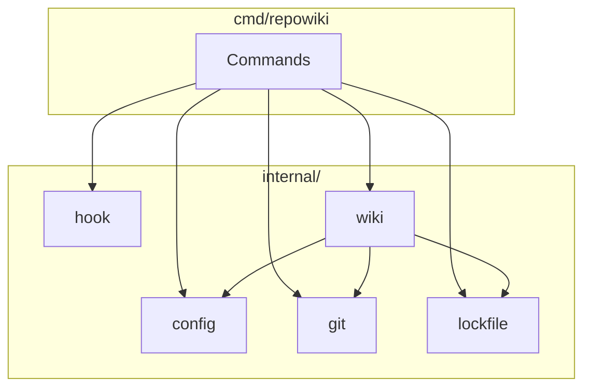

# Internal Packages

<cite>
Source files referenced:
- [internal/config/config.go](file://internal/config/config.go)
- [internal/git/git.go](file://internal/git/git.go)
- [internal/hook/hook.go](file://internal/hook/hook.go)
- [internal/lockfile/lockfile.go](file://internal/lockfile/lockfile.go)
</cite>

## Table of Contents

- [Package Overview](#package-overview)
- [config Package](#config-package)
- [git Package](#git-package)
- [hook Package](#hook-package)
- [lockfile Package](#lockfile-package)

## Package Overview

The `internal/` directory contains the core business logic, organized into focused packages:



## config Package

**File**: `internal/config/config.go`

Manages configuration loading, saving, and defaults.

### Constants

```go
const (
    ConfigDir  = ".repowiki"
    ConfigFile = "config.json"
    LogDir     = "logs"
)
```

### Config Struct

```go
type Config struct {
    Enabled               bool     `json:"enabled"`
    Engine                string   `json:"engine"`
    EnginePath            string   `json:"engine_path,omitempty"`
    Model                 string   `json:"model"`
    MaxTurns              int      `json:"max_turns"`
    Language              string   `json:"language"`
    AutoCommit            bool     `json:"auto_commit"`
    CommitPrefix          string   `json:"commit_prefix"`
    ExcludedPaths         []string `json:"excluded_paths"`
    WikiPath              string   `json:"wiki_path"`
    FullGenerateThreshold int      `json:"full_generate_threshold"`
    LastRun               string   `json:"last_run,omitempty"`
    LastCommitHash        string   `json:"last_commit_hash,omitempty"`
}
```

### Default Configuration

```go
func Default() *Config {
    return &Config{
        Enabled:      true,
        Engine:       EngineQoder,
        EnginePath:   "",
        Model:        "",
        MaxTurns:     50,
        Language:     "en",
        AutoCommit:   true,
        CommitPrefix: "[repowiki]",
        ExcludedPaths: []string{
            ".qoder/repowiki/",
            ".repowiki/",
            "node_modules/",
            "vendor/",
            ".git/",
        },
        WikiPath:              ".qoder/repowiki",
        FullGenerateThreshold: 20,
    }
}
```

Note: Engine constants (`EngineQoder`, `EngineClaudeCode`, `EngineCodex`) are defined for type safety and validation. The `EngineDetectOrder` slice defines the priority order for engine auto-detection: `claude-code` → `qoder` → `codex`.

### Path Helpers

```go
func Dir(gitRoot string) string {
    return filepath.Join(gitRoot, ConfigDir)
}

func Path(gitRoot string) string {
    return filepath.Join(Dir(gitRoot), ConfigFile)
}

func LogPath(gitRoot string) string {
    return filepath.Join(Dir(gitRoot), LogDir)
}
```

### Load and Save

```go
func Load(gitRoot string) (*Config, error) {
    data, err := os.ReadFile(Path(gitRoot))
    if err != nil {
        return nil, fmt.Errorf("failed to read config: %w", err)
    }
    var cfg Config
    if err := json.Unmarshal(data, &cfg); err != nil {
        return nil, fmt.Errorf("failed to parse config: %w", err)
    }
    // Migration: old configs without engine field default to qoder
    if cfg.Engine == "" {
        cfg.Engine = EngineQoder
    }
    return &cfg, nil
}

func Save(gitRoot string, cfg *Config) error {
    if err := os.MkdirAll(Dir(gitRoot), 0755); err != nil {
        return fmt.Errorf("failed to create config dir: %w", err)
    }
    data, err := json.MarshalIndent(cfg, "", "  ")
    if err != nil {
        return fmt.Errorf("failed to marshal config: %w", err)
    }
    data = append(data, '\n')
    return os.WriteFile(Path(gitRoot), data, 0644)
}
```

### Last Run Tracking

The `UpdateLastRun()` function updates the configuration after each successful wiki generation:

```go
func UpdateLastRun(gitRoot string, commitHash string) error {
    cfg, err := Load(gitRoot)
    if err != nil {
        return err
    }
    cfg.LastRun = time.Now().UTC().Format(time.RFC3339)
    cfg.LastCommitHash = commitHash
    return Save(gitRoot, cfg)
}
```

This function is called by the wiki engine (in `wiki.go`) when `auto_commit` is enabled. It tracks:
- `last_run`: ISO 8601 timestamp of when the wiki was last updated
- `last_commit_hash`: The git commit hash that was processed

These fields enable incremental updates by allowing the system to determine which files have changed since the last wiki generation using `git.ChangedFilesSince()`.

## git Package

**File**: `internal/git/git.go`

Provides Git repository operations.

### Core Function

```go
func run(dir string, args ...string) (string, error) {
    cmd := exec.Command("git", args...)
    if dir != "" {
        cmd.Dir = dir
    }
    out, err := cmd.Output()
    if err != nil {
        if exitErr, ok := err.(*exec.ExitError); ok {
            return "", fmt.Errorf("git %s: %s", 
                strings.Join(args, " "), 
                string(exitErr.Stderr))
        }
        return "", fmt.Errorf("git %s: %w", strings.Join(args, " "), err)
    }
    return strings.TrimSpace(string(out)), nil
}
```

### Repository Operations

```go
// FindRoot returns the git repository root
func FindRoot() (string, error) {
    return run("", "rev-parse", "--show-toplevel")
}

// FindRootFrom returns root from a specific directory
func FindRootFrom(dir string) (string, error) {
    return run(dir, "rev-parse", "--show-toplevel")
}
```

### Commit Operations

```go
// HeadCommit returns the current HEAD commit hash
func HeadCommit(gitRoot string) (string, error) {
    return run(gitRoot, "rev-parse", "HEAD")
}

// CommitMessage returns the full commit message
func CommitMessage(gitRoot string, hash string) (string, error) {
    return run(gitRoot, "log", "-1", "--pretty=%B", hash)
}
```

### Change Detection

```go
// ChangedFilesInCommit returns files changed in a specific commit
func ChangedFilesInCommit(gitRoot string, hash string) ([]string, error) {
    out, err := run(gitRoot, "diff-tree", "--no-commit-id", "--name-only", "-r", hash)
    if err != nil {
        return nil, err
    }
    if out == "" {
        return nil, nil
    }
    return strings.Split(out, "\n"), nil
}

// ChangedFilesSince returns files changed between a commit and HEAD
func ChangedFilesSince(gitRoot string, hash string) ([]string, error) {
    out, err := run(gitRoot, "diff", "--name-only", hash, "HEAD")
    if err != nil {
        return nil, err
    }
    if out == "" {
        return nil, nil
    }
    return strings.Split(out, "\n"), nil
}
```

### Staging and Committing

```go
// StageFiles adds files to the git index
func StageFiles(gitRoot string, paths []string) error {
    args := append([]string{"add"}, paths...)
    _, err := run(gitRoot, args...)
    return err
}

// Commit creates a new commit
func Commit(gitRoot string, message string) error {
    _, err := run(gitRoot, "commit", "-m", message)
    return err
}

// HasChanges checks if a path has uncommitted changes
func HasChanges(gitRoot string, path string) (bool, error) {
    out, err := run(gitRoot, "status", "--porcelain", path)
    if err != nil {
        return false, err
    }
    return out != "", nil
}
```

## hook Package

**File**: `internal/hook/hook.go`

Manages Git hook installation and removal.

### Constants

```go
const (
    markerStart = "# repowiki hook start"
    markerEnd   = "# repowiki hook end"
)
```

### Hook Script Template

```go
// Script generates the hook script using the absolute path to the repowiki binary.
func Script(binaryPath string) string {
    return markerStart + `
# Auto-generated by repowiki — do not edit this block
REPOWIKI_BIN="` + binaryPath + `"
if [ -x "$REPOWIKI_BIN" ]; then
  "$REPOWIKI_BIN" hooks post-commit &
elif command -v repowiki >/dev/null 2>&1; then
  repowiki hooks post-commit &
fi
` + markerEnd
}
```

### Install Hook

```go
func Install(gitRoot string, force bool, binaryPath string) error {
    hp := hookPath(gitRoot)

    // Ensure hooks directory exists
    if err := os.MkdirAll(filepath.Dir(hp), 0755); err != nil {
        return fmt.Errorf("failed to create hooks dir: %w", err)
    }

    // Read existing hook file if present
    data, err := os.ReadFile(hp)
    if err == nil {
        content := string(data)
        if strings.Contains(content, markerStart) {
            if !force {
                return fmt.Errorf("repowiki hook already installed")
            }
            content = removeBlock(content)
        }
        content = strings.TrimRight(content, "\n") + "\n\n" + Script(binaryPath) + "\n"
        return os.WriteFile(hp, []byte(content), 0755)
    }

    // Create new hook file
    content := "#!/bin/sh\n\n" + Script(binaryPath) + "\n"
    return os.WriteFile(hp, []byte(content), 0755)
}
```

### Uninstall Hook

```go
func Uninstall(gitRoot string) error {
    hp := hookPath(gitRoot)
    data, err := os.ReadFile(hp)
    if err != nil {
        return nil // No hook file
    }

    content := removeBlock(string(data))
    trimmed := strings.TrimSpace(content)

    // If only shebang remains, remove the file
    if trimmed == "#!/bin/sh" || trimmed == "" {
        return os.Remove(hp)
    }

    return os.WriteFile(hp, []byte(content), 0755)
}
```

### Check Installation

```go
func IsInstalled(gitRoot string) bool {
    data, err := os.ReadFile(hookPath(gitRoot))
    if err != nil {
        return false
    }
    return strings.Contains(string(data), markerStart)
}
```

### Helper Functions

```go
func hookPath(gitRoot string) string {
    return filepath.Join(gitRoot, ".git", "hooks", "post-commit")
}

func removeBlock(content string) string {
    startIdx := strings.Index(content, markerStart)
    endIdx := strings.Index(content, markerEnd)
    if startIdx == -1 || endIdx == -1 {
        return content
    }
    endIdx += len(markerEnd)
    if endIdx < len(content) && content[endIdx] == '\n' {
        endIdx++
    }
    return content[:startIdx] + content[endIdx:]
}
```

## lockfile Package

**File**: `internal/lockfile/lockfile.go`

Provides process-level locking to prevent concurrent repowiki runs.

### Constants

```go
const lockFileName = ".repowiki.lock"
```

### Lock Path

```go
func lockPath(gitRoot string) string {
    return filepath.Join(gitRoot, ".repowiki", lockFileName)
}
```

### Acquire Lock

```go
func Acquire(gitRoot string) error {
    lp := lockPath(gitRoot)

    if err := os.MkdirAll(filepath.Dir(lp), 0755); err != nil {
        return fmt.Errorf("failed to create lock dir: %w", err)
    }

    // Check for stale lock first
    if IsLocked(gitRoot) {
        if isStale(lp) {
            os.Remove(lp)
        } else {
            return fmt.Errorf("another repowiki process is running")
        }
    }

    // Create exclusive lock file
    f, err := os.OpenFile(lp, os.O_CREATE|os.O_EXCL|os.O_WRONLY, 0644)
    if err != nil {
        if os.IsExist(err) {
            return fmt.Errorf("another repowiki process is running")
        }
        return fmt.Errorf("failed to create lock: %w", err)
    }
    defer f.Close()

    // Write PID and timestamp
    fmt.Fprintf(f, "%d\n%s\n", os.Getpid(), time.Now().UTC().Format(time.RFC3339))
    return nil
}
```

### Release Lock

```go
func Release(gitRoot string) {
    os.Remove(lockPath(gitRoot))
}
```

### Check Lock Status

```go
func IsLocked(gitRoot string) bool {
    _, err := os.Stat(lockPath(gitRoot))
    return err == nil
}
```

### Stale Lock Detection

```go
func isStale(lp string) bool {
    data, err := os.ReadFile(lp)
    if err != nil {
        return true
    }

    lines := strings.SplitN(string(data), "\n", 3)
    if len(lines) < 1 {
        return true
    }

    // Check if PID is still running
    pid, err := strconv.Atoi(strings.TrimSpace(lines[0]))
    if err != nil {
        return true
    }

    proc, err := os.FindProcess(pid)
    if err != nil {
        return true
    }

    // Send signal 0 to check process
    err = proc.Signal(os.Signal(nil))
    if err != nil {
        return true
    }

    // Check age - stale if older than 30 minutes
    if len(lines) >= 2 {
        ts, err := time.Parse(time.RFC3339, strings.TrimSpace(lines[1]))
        if err == nil && time.Since(ts) > 30*time.Minute {
            return true
        }
    }

    return false
}
```
