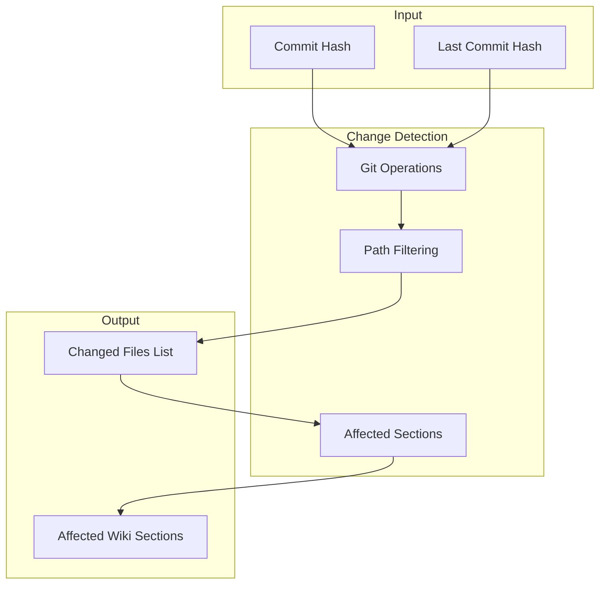

# Change Detection

<cite>
Source files referenced:
- [internal/wiki/detect.go](/to/internal/wiki/detect.go)
- [cmd/repowiki/update.go](/to/cmd/repowiki/update.go)
- [internal/git/git.go](/to/internal/git/git.go)
</cite>

## Table of Contents

- [Overview](#overview)
- [Change Detection Flow](#change-detection-flow)
- [Git Operations](#git-operations)
- [File Filtering](#file-filtering)
- [Affected Section Detection](#affected-section-detection)
- [Heuristic Matching](#heuristic-matching)

## Overview

Change detection determines which files have been modified and which wiki sections need updating. The system uses Git operations to identify changes and heuristics to map them to documentation sections.



## Change Detection Flow

**File**: `cmd/repowiki/update.go`

```go
func handleUpdate(args []string) {
    // ...

    // Determine which commit to process
    hash := *commitHash
    if hash == "" {
        hash, err = git.HeadCommit(gitRoot)
        if err != nil {
            fmt.Fprintf(os.Stderr, "Error getting HEAD: %v\n", err)
            os.Exit(1)
        }
    }

    // Get changed files
    var changedFiles []string
    if cfg.LastCommitHash != "" && cfg.LastCommitHash != hash {
        // Incremental: changes since last processed commit
        changedFiles, err = git.ChangedFilesSince(gitRoot, cfg.LastCommitHash)
    } else {
        // First run: changes in current commit only
        changedFiles, err = git.ChangedFilesInCommit(gitRoot, hash)
    }
    if err != nil {
        fmt.Fprintf(os.Stderr, "Error detecting changes: %v\n", err)
        os.Exit(1)
    }

    // Filter excluded paths
    changedFiles = filterExcluded(changedFiles, cfg.ExcludedPaths)

    if len(changedFiles) == 0 {
        if !*fromHook {
            fmt.Println("No relevant file changes detected.")
        }
        return
    }

    // Decide: full generate or incremental
    if !wiki.Exists(gitRoot, cfg) || len(changedFiles) > cfg.FullGenerateThreshold {
        if !*fromHook {
            fmt.Printf("Running full wiki generation (%d files changed)...\n", len(changedFiles))
        }
        if err := wiki.FullGenerate(gitRoot, cfg, hash); err != nil {
            fmt.Fprintf(os.Stderr, "Error: %v\n", err)
            os.Exit(1)
        }
    } else {
        if !*fromHook {
            fmt.Printf("Updating wiki for %d changed files...\n", len(changedFiles))
        }
        if err := wiki.IncrementalUpdate(gitRoot, cfg, changedFiles, hash); err != nil {
            fmt.Fprintf(os.Stderr, "Error: %v\n", err)
            os.Exit(1)
        }
    }

    if !*fromHook {
        fmt.Println("Wiki update complete.")
    }
}
```

## Git Operations

**File**: `internal/git/git.go`

### Changed Files in Commit

Returns files modified in a specific commit:

```go
func ChangedFilesInCommit(gitRoot string, hash string) ([]string, error) {
    out, err := run(gitRoot, "diff-tree", "--no-commit-id", "--name-only", "-r", hash)
    if err != nil {
        return nil, err
    }
    if out == "" {
        return nil, nil
    }
    return strings.Split(out, "\n"), nil
}
```

**Git command**: `git diff-tree --no-commit-id --name-only -r <hash>`

### Changed Files Since

Returns files changed between a commit and HEAD:

```go
func ChangedFilesSince(gitRoot string, hash string) ([]string, error) {
    out, err := run(gitRoot, "diff", "--name-only", hash, "HEAD")
    if err != nil {
        return nil, err
    }
    if out == "" {
        return nil, nil
    }
    return strings.Split(out, "\n"), nil
}
```

**Git command**: `git diff --name-only <hash> HEAD`

### Comparison

| Function | Use Case | Git Command |
|----------|----------|-------------|
| `ChangedFilesInCommit` | First run, specific commit | `diff-tree --no-commit-id --name-only -r` |
| `ChangedFilesSince` | Incremental updates | `diff --name-only <hash> HEAD` |

## File Filtering

**File**: `cmd/repowiki/update.go`

Filters out excluded paths from the changed files list:

```go
func filterExcluded(files []string, excluded []string) []string {
    var result []string
    for _, f := range files {
        skip := false
        for _, ex := range excluded {
            if len(f) >= len(ex) && f[:len(ex)] == ex {
                skip = true
                break
            }
        }
        if !skip {
            result = append(result, f)
        }
    }
    return result
}
```

### Default Excluded Paths

From `config.Default()`:

```go
ExcludedPaths: []string{
    ".qoder/repowiki/",   // Wiki output
    ".repowiki/",         // Config and logs
    "node_modules/",      // Node dependencies
    "vendor/",            // Go vendor
    ".git/",              // Git internals
},
```

### Example

```
Input files:
  - cmd/repowiki/main.go
  - .qoder/repowiki/en/content/System Overview.md
  - node_modules/lodash/index.js
  - internal/config/config.go

After filtering:
  - cmd/repowiki/main.go
  - internal/config/config.go
```

## Affected Section Detection

**File**: `internal/wiki/detect.go`

Determines which wiki sections need updating based on changed files:

```go
func AffectedSections(gitRoot string, cfg *config.Config, changedFiles []string) []string {
    affected := map[string]bool{}

    // 1. Build reverse index from metadata
    reverseIdx := buildReverseIndex(gitRoot, cfg)
    for _, f := range changedFiles {
        if pages, ok := reverseIdx[f]; ok {
            for _, p := range pages {
                affected[p] = true
            }
        }
    }

    // 2. Heuristic path matching
    for _, f := range changedFiles {
        for _, section := range heuristicMatch(f) {
            affected[section] = true
        }
    }

    result := make([]string, 0, len(affected))
    for s := range affected {
        result = append(result, s)
    }
    return result
}
```

### Reverse Index Building

Maps source files to wiki pages that reference them:

```go
func buildReverseIndex(gitRoot string, cfg *config.Config) map[string][]string {
    idx := map[string][]string{}

    // Read metadata file
    metaPath := filepath.Join(gitRoot, cfg.WikiPath, cfg.Language, "meta", "repowiki-metadata.json")
    data, err := os.ReadFile(metaPath)
    if err != nil {
        return idx
    }

    var meta metadata
    if err := json.Unmarshal(data, &meta); err != nil {
        return idx
    }

    // Collect source file paths from metadata
    sourceFiles := map[string]bool{}
    for _, s := range meta.CodeSnippets {
        sourceFiles[s.Path] = true
    }

    // Scan wiki content for references
    contentDir := filepath.Join(gitRoot, cfg.WikiPath, cfg.Language, "content")
    scanWikiContent(contentDir, "", sourceFiles, idx)

    return idx
}
```

### Wiki Content Scanning

```go
func scanWikiContent(dir string, relDir string, sourceFiles map[string]bool, idx map[string][]string) {
    entries, err := os.ReadDir(dir)
    if err != nil {
        return
    }

    for _, e := range entries {
        if e.IsDir() {
            subRel := filepath.Join(relDir, e.Name())
            scanWikiContent(filepath.Join(dir, e.Name()), subRel, sourceFiles, idx)
            continue
        }

        if !strings.HasSuffix(e.Name(), ".md") {
            continue
        }

        wikiPage := filepath.Join(relDir, e.Name())
        data, err := os.ReadFile(filepath.Join(dir, e.Name()))
        if err != nil {
            continue
        }

        content := string(data)
        // Look for file:// references in <cite> blocks
        for srcFile := range sourceFiles {
            if strings.Contains(content, "file://"+srcFile) ||
               strings.Contains(content, srcFile) {
                idx[srcFile] = append(idx[srcFile], wikiPage)
            }
        }
    }
}
```

## Heuristic Matching

**File**: `internal/wiki/detect.go`

Uses file path patterns to suggest affected wiki sections:

```go
func heuristicMatch(filePath string) []string {
    var sections []string
    lower := strings.ToLower(filePath)

    switch {
    case strings.Contains(lower, "backend/") ||
         strings.Contains(lower, "server/") ||
         strings.Contains(lower, "src/api/"):
        sections = append(sections, "Backend Architecture")

    case strings.Contains(lower, "frontend/") ||
         strings.Contains(lower, "src/components/") ||
         strings.Contains(lower, "src/app/"):
        sections = append(sections, "Frontend Architecture")
    }

    if strings.Contains(lower, "api/") ||
       strings.Contains(lower, "routes/") ||
       strings.Contains(lower, "endpoints/") {
        sections = append(sections, "API Reference")
    }

    if strings.Contains(lower, "config") ||
       strings.Contains(lower, ".env") ||
       strings.Contains(lower, "settings") {
        sections = append(sections, "Configuration Management")
    }

    if strings.HasSuffix(lower, "readme.md") ||
       strings.HasSuffix(lower, "package.json") ||
       strings.HasSuffix(lower, "pyproject.toml") {
        sections = append(sections, "System Overview")
    }

    if strings.Contains(lower, "auth") ||
       strings.Contains(lower, "security") {
        sections = append(sections, "Authentication and Security")
    }

    if strings.Contains(lower, "database/") ||
       strings.Contains(lower, "models/") ||
       strings.Contains(lower, "migrations/") {
        sections = append(sections, "Backend Architecture")
    }

    return sections
}
```

### Heuristic Patterns

| Pattern | Suggested Section |
|---------|-------------------|
| `backend/`, `server/`, `src/api/` | Backend Architecture |
| `frontend/`, `src/components/`, `src/app/` | Frontend Architecture |
| `api/`, `routes/`, `endpoints/` | API Reference |
| `config`, `.env`, `settings` | Configuration Management |
| `README.md`, `package.json` | System Overview |
| `auth`, `security` | Authentication and Security |
| `database/`, `models/`, `migrations/` | Backend Architecture |

### Usage in Incremental Update

```go
// internal/wiki/wiki.go
func IncrementalUpdate(gitRoot string, cfg *config.Config, changedFiles []string) error {
    // ...

    // Determine affected wiki sections
    affectedSections := AffectedSections(gitRoot, cfg, changedFiles)
    logf(gitRoot, "affected sections: %v", affectedSections)

    // Build prompt with affected sections hint
    prompt := BuildIncrementalPrompt(cfg, changedFiles, affectedSections)

    // Execute Qoder with targeted prompt
    output, err := runQoder(cfg, gitRoot, prompt)
    // ...
}
```

The affected sections are included in the prompt to guide the AI toward relevant documentation updates.
