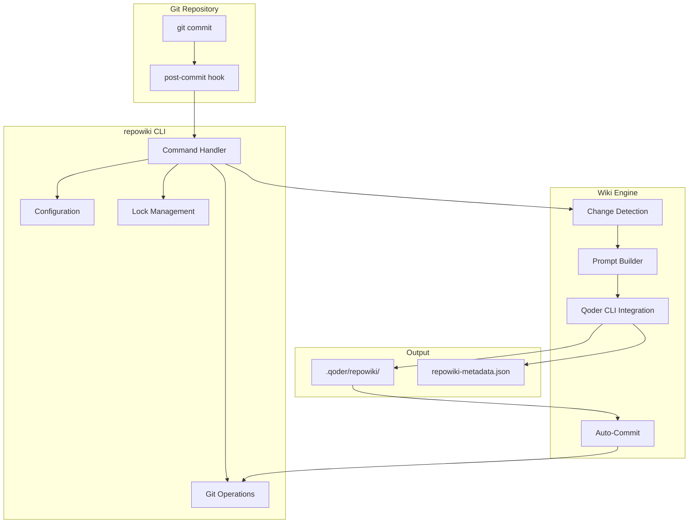
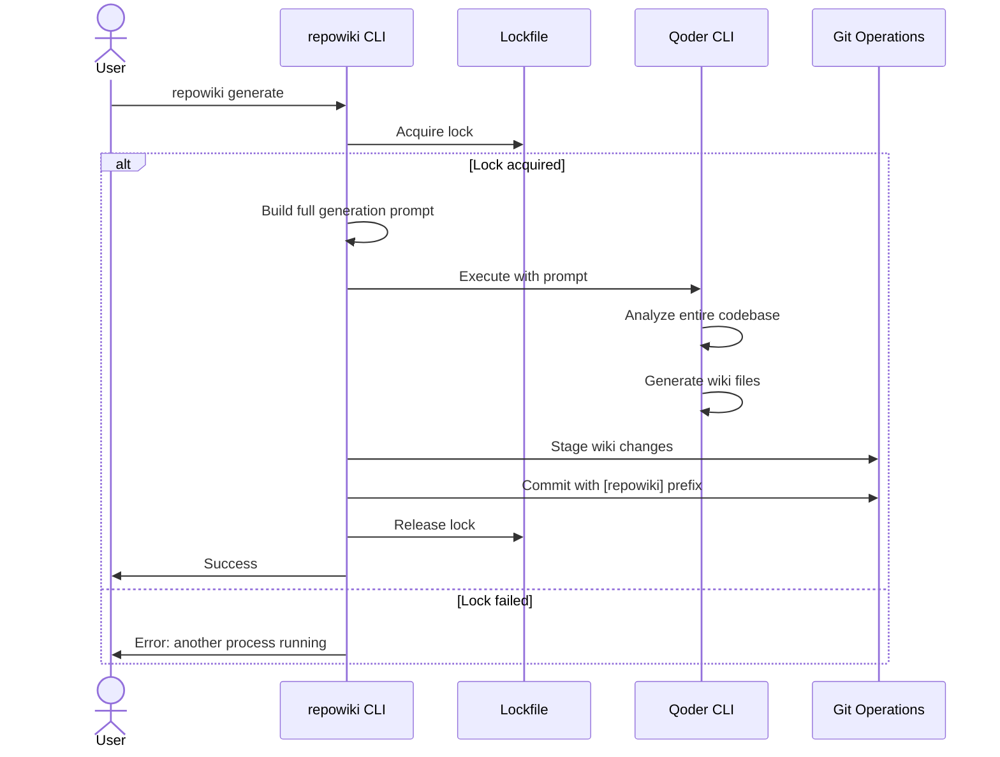
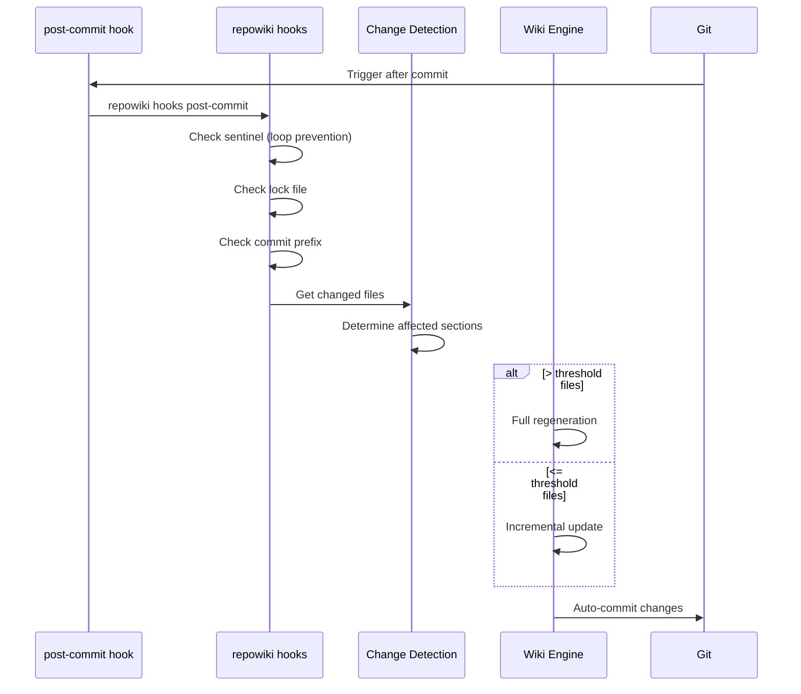

# System Overview

<cite>
Source files referenced:
- [CLAUDE.md](/to/CLAUDE.md)
- [README.md](/to/README.md)
- [cmd/repowiki/main.go](/to/cmd/repowiki/main.go)
- [go.mod](/to/go.mod)
</cite>

## Table of Contents

- [Introduction](#introduction)
- [Project Purpose](#project-purpose)
- [High-Level Architecture](#high-level-architecture)
- [Key Components](#key-components)
- [Workflow](#workflow)
- [Design Principles](#design-principles)

## Introduction

**repowiki** is a Go-based CLI tool that automatically generates and maintains repository documentation (wiki) on every git commit. It integrates with the [Qoder](https://qoder.com) IDE/CLI to analyze code changes and produce comprehensive, up-to-date documentation.

## Project Purpose

The tool solves the common problem of documentation drift — when code changes but documentation remains stale. By hooking into the git commit process, repowiki ensures that documentation stays synchronized with the codebase automatically.

Key capabilities:
- **Automatic wiki generation** triggered on every git commit
- **Incremental updates** for efficient processing of small changes
- **Full regeneration** when significant changes occur
- **Loop prevention** to avoid infinite commit cycles (3-layer protection)
- **Configurable** via JSON configuration file
- **Hook coexistence** — works alongside existing git hooks without disruption

## High-Level Architecture



## Key Components

### 1. CLI Interface (`cmd/repowiki/`)
The command-line interface provides user-facing commands:
- `enable` — Install git hook and configure the project
- `disable` — Remove hook and disable functionality
- `status` — Display current configuration and status
- `generate` — Full wiki generation from scratch
- `update` — Incremental update for recent changes
- `hooks` — Internal hook entry point

### 2. Internal Packages (`internal/`)

| Package | Purpose |
|---------|---------|
| `config` | Configuration loading, saving, and management |
| `git` | Git operations (find root, get commits, changed files) |
| `hook` | Git hook installation and removal |
| `lockfile` | Process-level locking to prevent concurrent runs |
| `wiki` | Core wiki generation logic and Qoder integration |

### 3. Configuration System
Configuration is stored in `.repowiki/config.json`:

```json
{
  "enabled": true,
  "qodercli_path": "qodercli",
  "model": "auto",
  "max_turns": 50,
  "language": "en",
  "auto_commit": true,
  "commit_prefix": "[repowiki]",
  "wiki_path": ".qoder/repowiki",
  "full_generate_threshold": 20
}
```

## Workflow

### Full Generation Flow



### Incremental Update Flow



## Design Principles

1. **Non-intrusive**: Works alongside existing git workflows without disrupting developer flow
2. **Safe**: Multiple layers of loop prevention ensure wiki commits don't trigger themselves
3. **Efficient**: Incremental updates for small changes, full regeneration only when needed
4. **Configurable**: Extensive configuration options via JSON file
5. **Portable**: Single binary with minimal dependencies (Go standard library only)
